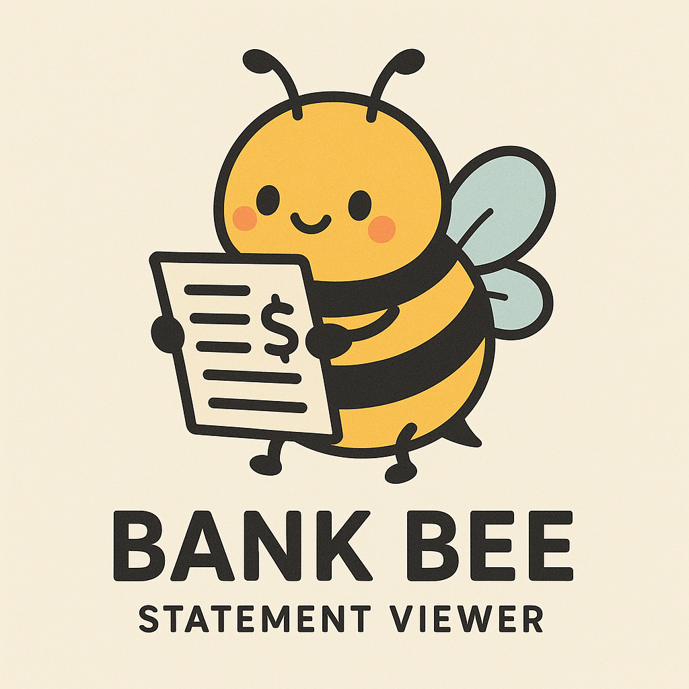

# 🐝 Bank Bee CSV

<div align="center">
  
</div>

A privacy-first bank statement analyzer that processes your CSV files locally in your browser. Visualize your spending patterns, track income sources, and understand your financial habits - all without uploading sensitive data anywhere.


## ✨ Features

### 📊 Multiple Visualization Options
- **Pie Charts** - See categorical breakdowns of income and expenses
- **Day-by-Day Line Charts** - Track daily spending patterns and cash flow
- **Side-by-Side Comparison** - View income and expenses simultaneously

### 🏦 Multi-Bank Support
- **NKBM/OTP** - Full support for DOBRO (income) and BREME (expense) columns
- **NLB** - Slovenian bank format
- **Intesa Sanpaolo** - Italian bank format
- **Erste Bank Serbia** - Erste bank (Serbia) format
- Easy to extend for additional banks

### 🔍 Smart Analysis
- **Category Detection** - Automatically categorizes transactions (Groceries, Gas, Restaurants, etc.)
- **Recipient Analysis** - See your most frequent transaction partners
- **Monthly Totals** - Quick overview of total income and expenses
- **Transaction Frequency** - Track how often you transact with specific vendors

### 🔒 Privacy & Security
- **100% Client-Side** - All processing happens in your browser
- **No Data Upload** - Your financial data never leaves your computer
- **No Server** - No backend, no databases, no tracking
- **Open Source** - Inspect the code to verify security

## 🚀 Quick Start

### Online Version
Visit the deployed version at: https://stefasaur.github.io/bank-bee-csv/

### Local Development
```bash
# Clone the repository
git clone https://github.com/Stefasaur/bank-bee-csv.git
cd bank-bee-csv

# Install dependencies
npm install

# Start development server
npm run dev

# Build for production
npm run build
```

## 📝 How to Use

1. **Download your bank statement** as a CSV file from your bank's website
2. **Open Bank Bee CSV** in your browser
3. **Select your bank** from the dropdown (NKBM/OTP, NLB, or Intesa Sanpaolo)
4. **Drag and drop** your CSV file or click to upload
5. **Explore your data**:
   - Toggle between Category and Recipient views
   - Switch between Pie and Day-by-Day charts
   - Select different months to analyze

## 🎯 Supported CSV Formats

### NKBM/OTP Bank
- Income column: `DOBRO`
- Expense column: `BREME`
- Date format: `dd.mm.yyyy`

### NLB
- Income column: `Prilivi`
- Expense column: `Odlivi`
- Date format: `dd.mm.yyyy`

### Intesa Sanpaolo
- Income column: `Accrediti`
- Expense column: `Addebiti`
- Date format: `dd/mm/yyyy`

### Erste Bank Serbia
- **File format**: `.xls` (Excel format from online banking)
- Amount column: `Iznos` (single column with positive/negative values)
- Date column: `Datum valute`
- Description column: `Opis`
- Recipient column: `Opis` (transaction description used as recipient)
- Date format: `dd.mm.yyyy`
- Currency: `RSD` (Serbian Dinar)

## 🛠️ Technology Stack

- **TypeScript** - Type-safe development
- **Chart.js** - Beautiful, responsive charts
- **Webpack** - Modern bundling
- **XLSX (SheetJS)** - Robust CSV/Excel parsing

## 📦 Project Structure

```
bank-bee-csv/
├── src/
│   ├── index.html          # Main HTML file
│   ├── index.ts           # Core application logic
│   ├── assets/
│   │   └── images/        # Bank logos
│   └── types/             # TypeScript declarations
├── dist/                  # Production build
├── webpack.config.js      # Build configuration
├── tsconfig.json         # TypeScript configuration
└── package.json          # Dependencies
```

## 🤝 Contributing

Contributions are welcome! Feel free to:
- Add support for more banks
- Improve transaction categorization
- Add new visualization types
- Enhance the UI/UX
- Report bugs or suggest features

## 📄 License

This project is open source and available under the [MIT License](LICENSE).

## 🔐 Privacy Notice

Bank Bee CSV is designed with privacy as the top priority:
- ✅ All data processing happens locally in your browser
- ✅ No data is ever sent to any server
- ✅ No cookies or tracking
- ✅ No user accounts or authentication
- ✅ Your financial data remains 100% private

## 🐝 Why "Bank Bee"?

Just like bees efficiently collect and organize pollen, Bank Bee CSV helps you collect and organize your financial data - buzzing through your transactions to create sweet visualizations of your spending patterns!

---

Made with ❤️ for privacy-conscious financial tracking